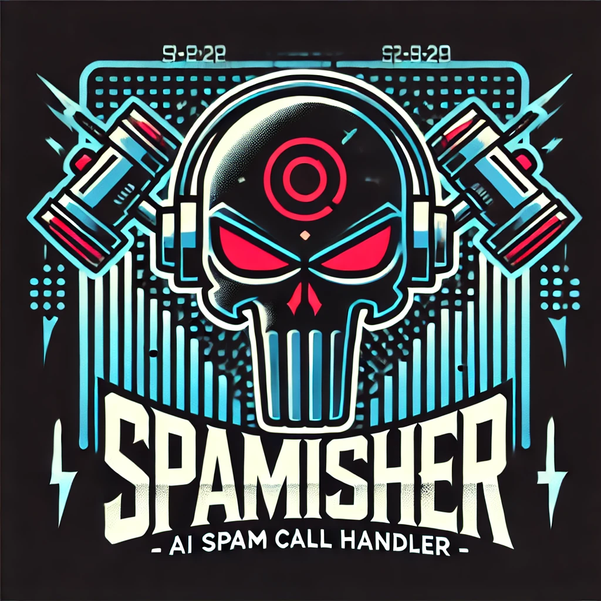

# Spamisher

## AI Spam Call Handler

Check back later as this project is updated.

To run this project, entry point is app.py.  

*Short Project Description*

Telemarketing call centers have deployed AI to make repeated calls to targetted busy and oftentimes vulnerable individuals.  

This app aims to respond and hit back, using AI to generate canned responses, text-to-speech conversation loops and speech to text.

The long project description and code itself is also developed through Cursor, GPT-4o, and Grok.  

As always, ethical use of this code is expected of end users. This technology is a pebble compared to the armament major conglomerates have at their disposal.

Models like the sesame/csm-1b variant are also open-source voice cloning engines that may be used in this fashion. Note that the legality of cloning your own voice is also available in the legal disclosure.

